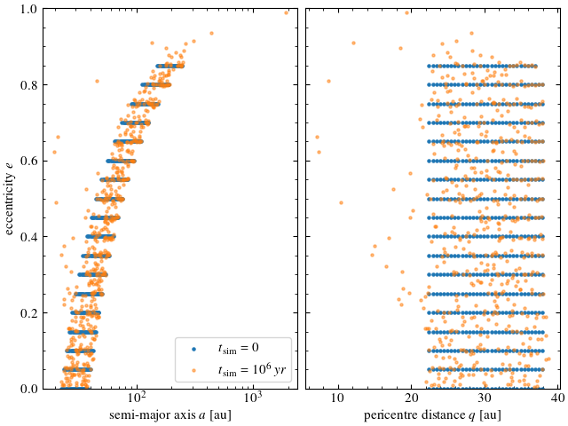

# Notes

## Simulation properties

| Integrator  | $dt_{min,ias15}$ [yr] |        $dt$        | $r_{crit,hill}$ | $t_{integration}$   | Runtime |   $dE$   | File ending |
|:------------|:---------------------:|:------------------:|:---------------:|:-------------------:|:-------:|:--------:|:-----------:|
|ias15        |           1           |         -          |        -        |          10e6       |   >8h   |    ?     |             |
|mercurius    |          0.5          | 0.01 $P_{Neptune}$ |      5 au       |          10e6       |  6108s  | 7.39e-10 |   	01		     |
|mercurius    |          0.3          | 0.05 $P_{Neptune}$ |      3 au       |          10e6       | 19675s  | 1.82e-8  |    	02		    |
|mercurius    |          0.6          | 0.1 $P_{Neptune}$  |      4 au       |          10e6       |   >4h   | ?        |    	03		    |
|mercurius    |           1           |        2 yr        |      2 au       |          10e6       |   >1h   | ?        |    	04		    |

**Remarks**
- "?" in $dE$ means that the simulation was terminated because the runtime was too long  
- The minimal timestep of the ias15-integrator ( $dt_{min,ias15}$ ) seems to have a large effect on the runtime. 0.5 yr seems to be a good compromise.

## Plots
1. **sim 02**

  

